# Audit evidence — running app (Stage 1 · Measure)

> **Status: Stage 1 evidence. No critique, no plan, no product-code changes.** Everything here was observed on the running application unless it is explicitly labelled *static* (source read) or *modelled*. Companion: [`TASK_BENCHMARKS.md`](./TASK_BENCHMARKS.md). Raw data: [`data/`](./data). Scripts that produced it: [`measure/`](./measure).

## 0. Provenance and limits

| Item | Detail |
|---|---|
| App under test | `apps/web` — Next.js 15.5 **production build** (`next start`), React 19, next-intl (en / ar, `dir` from locale) |
| Backend | `apps/api` Express 5 on localhost:4000 · PostgreSQL 16 with RLS on localhost · S3 stand-in on :9000 |
| Browser | Chromium 1194 via Playwright 1.56.1, `isMobile`, touch, DPR 2 |
| Data | `seed.ts` + `seed-demo-content.ts` + `docs/ux/measure/00-seed-audit-extras.mjs`; persona Sara Haddad (owner/admin) |
| Not measured | **Mobile app** (Expo) — no emulator/device available; only source was read (*static*). **Real devices, real networks** — API/DB are on localhost, so latency understates the field. **Lighthouse/TTI** — not available; FCP, LCP and a long-task total-blocking-time proxy are reported instead. **Screen readers.** |
| Emulation (labelled where used) | “emulated-mid-phone” = CDP CPU throttle 4× + 150 ms RTT + 1.6/0.75 Mbps. It is an emulation, not a device. |
| Dark mode | There is no dark theme in the web app. Screenshots were still taken with `prefers-color-scheme: dark` emulated so this can be seen: **72 of 72** dark screenshots are byte-identical to their light counterpart. |
| Arabic rendering | The sandbox has no Arabic system font that matches Poppins, so Arabic glyphs render in a fallback face; glyph shapes in Arabic screenshots are environment-dependent, layout (mirroring, wrapping) is not. |
| Incidental finding | `POST /projects` returned HTTP 500 in this environment (PostgreSQL RLS violation on the `projects` insert, error 42501). Not investigated (Stage 1). The extra project used for empty-state testing was inserted with SQL. |

## 1. Route and screen inventory

**Web:** 60 page routes; the project sidebar links 31 of them. Derived by scanning `apps/web/app` for page files and every literal `href`/`router.push`/`router.replace` target, plus the non-literal navigation sources read by hand (notification bell, global search results, project selector, dashboard action links). *Static analysis is used only to enumerate routes and links; behaviour was verified by running the app.*

Legend — **ORPHAN**: nothing links to it. **shell-only**: reachable only from the sidebar/search/bell, never contextually from another screen. **DEAD-END**: no link out of the page body to any other route (the shell chrome is still present). **NO-SIBLING**: a detail screen with no way to reach another record of the same type without returning to the list.

| Route | Kind | Linked from (pages) | Linked from (shell) | Flags |
|---|---|---|---|---|
| `/accept-invite` | list/screen | — | — | **ORPHAN** |
| `/companies/[id]/admin` | list/screen | `/companies` | — | — |
| `/companies/[id]/dashboard` | list/screen | `/companies` | — | — |
| `/companies` | list/screen | `/companies/[id]/admin`, `/companies/[id]/dashboard`, `/projects` | GlobalSearch | — |
| `/login` | list/screen | 54 pages (`/companies/[id]/admin`, `/companies/[id]/dashboard`, `/companies`, …) | — | — |
| `/` | redirect | — | UserMenu.tsx | shell-only |
| `P/analytics` | list/screen | — | ProjectSidebar | shell-only |
| `P/bidding/[bidPackageId]` | detail | `P/bidding` | — | NO-SIBLING |
| `P/bidding` | list/screen | `P/bidding/[bidPackageId]` | ProjectSidebar | — |
| `P/billing/[paymentApplicationId]` | detail | `P/billing` | — | NO-SIBLING |
| `P/billing` | list/screen | `P/billing/[paymentApplicationId]` | ProjectSidebar | — |
| `P/budget` | list/screen | — | ProjectSidebar | shell-only |
| `P/change-orders/[changeOrderId]` | detail | `P/change-orders` | NotificationBell | NO-SIBLING |
| `P/change-orders` | list/screen | `P/change-orders/[changeOrderId]`, `P/dashboard` | ProjectSidebar | — |
| `P/commitments/[commitmentId]` | detail | `P/commitments` | — | NO-SIBLING |
| `P/commitments` | list/screen | `P/commitments/[commitmentId]` | ProjectSidebar | — |
| `P/correspondence/[correspondenceId]` | detail | `P/correspondence` | — | NO-SIBLING |
| `P/correspondence` | list/screen | `P/correspondence/[correspondenceId]` | ProjectSidebar | — |
| `P/daily-log/[logId]` | detail | `P/daily-log/new`, `P/daily-log` | GlobalSearch | **DEAD-END**, NO-SIBLING |
| `P/daily-log/new` | create | `P/daily-log` | — | — |
| `P/daily-log` | list/screen | — | ProjectSidebar | shell-only |
| `P/dashboard` | list/screen | `/companies/[id]/dashboard` | ProjectSidebar, GlobalSearch, ProjectSelector | — |
| `P/direct-costs` | list/screen | — | ProjectSidebar | shell-only |
| `P/directory` | list/screen | `/projects` | ProjectSidebar, GlobalSearch | — |
| `P/documents` | list/screen | — | ProjectSidebar, GlobalSearch | shell-only |
| `P/drawings/[drawingId]` | detail | `P/drawings` | GlobalSearch | NO-SIBLING |
| `P/drawings` | list/screen | `P/drawings/[drawingId]` | ProjectSidebar | — |
| `P/estimating/[estimateId]` | detail | `P/estimating` | — | NO-SIBLING |
| `P/estimating` | list/screen | `P/estimating/[estimateId]` | ProjectSidebar | — |
| `P/gantt` | list/screen | — | ProjectSidebar | shell-only |
| `P/inspections/[inspectionId]` | detail | `P/inspections` | — | NO-SIBLING |
| `P/inspections` | list/screen | `P/inspections/[inspectionId]` | ProjectSidebar | — |
| `P/inspections/templates` | list/screen | `P/inspections` | — | — |
| `P/lookahead` | list/screen | — | ProjectSidebar | shell-only |
| `P/meetings/[meetingId]` | detail | `P/meetings` | — | NO-SIBLING |
| `P/meetings` | list/screen | `P/meetings/[meetingId]` | ProjectSidebar | — |
| `P/permissions` | list/screen | — | ProjectSidebar | shell-only |
| `P/photos` | list/screen | — | ProjectSidebar | shell-only |
| `P/prequalification` | list/screen | — | ProjectSidebar | shell-only |
| `P/prime-contract` | list/screen | — | ProjectSidebar | shell-only |
| `P/progress-updates` | list/screen | — | ProjectSidebar | shell-only |
| `P/punch-list/[itemId]` | detail | `P/inspections/[inspectionId]`, `P/punch-list/new`, `P/punch-list` | NotificationBell | **DEAD-END**, NO-SIBLING |
| `P/punch-list/new` | create | `P/punch-list` | — | — |
| `P/punch-list` | list/screen | — | ProjectSidebar | shell-only |
| `P/rfis/[rfiId]` | detail | `P/drawings/[drawingId]`, `P/rfis`, `P/specifications/[specSectionId]` | PdfViewerModal.tsx, NotificationBell, GlobalSearch | NO-SIBLING |
| `P/rfis` | list/screen | `P/rfis/[rfiId]`, `P/dashboard` | ProjectSidebar | — |
| `P/safety/[incidentId]` | detail | `P/safety` | — | NO-SIBLING |
| `P/safety/observations` | list/screen | `P/safety` | — | — |
| `P/safety` | list/screen | `P/safety/[incidentId]`, `P/safety/observations` | ProjectSidebar | — |
| `P/schedule/[taskId]` | detail | `P/schedule` | GlobalSearch | NO-SIBLING |
| `P/schedule` | list/screen | `P/schedule/[taskId]`, `P/dashboard` | ProjectSidebar | — |
| `P/settings` | list/screen | — | ProjectSidebar | shell-only |
| `P/specifications/[specSectionId]` | detail | `P/submittals/[submittalId]` | — | NO-SIBLING |
| `P/submittals/[submittalId]` | detail | `P/specifications/[specSectionId]`, `P/submittals` | NotificationBell, GlobalSearch | NO-SIBLING |
| `P/submittals` | list/screen | `P/specifications/[specSectionId]`, `P/submittals/[submittalId]`, `P/dashboard` | ProjectSidebar | — |
| `P/tm-tickets/[ticketId]` | detail | `P/tm-tickets` | — | NO-SIBLING |
| `P/tm-tickets` | list/screen | `P/tm-tickets/[ticketId]` | ProjectSidebar | — |
| `P/transmittals/[transmittalId]` | detail | `P/transmittals` | — | NO-SIBLING |
| `P/transmittals` | list/screen | `P/transmittals/[transmittalId]` | ProjectSidebar | — |
| `/projects` | list/screen | 7 pages (`/accept-invite`, `/companies`, `/login`, …) | error.tsx | — |

Counts: ORPHAN = 1 (`/accept-invite`); DEAD-END = 2 (`/projects/[id]/daily-log/[logId]`, `/projects/[id]/punch-list/[itemId]`); NO-SIBLING detail screens = 18 of 18 detail routes.

Notes: `/accept-invite` is entered from an emailed link, so having no inbound link is expected. `/` only redirects. The project sidebar is **hidden behind the ☰ button below 768 px**; at 390 px every module is one tap (☰) plus one tap away, on every project screen. The project list (`/projects`) links only to each project's **Directory** (“View directory”); there is no route from it to the dashboard or any other module.

**Mobile (static):** 41 screens under `apps/mobile/app`; project home = 17 module tiles; the same module set is reachable from tiles, but there is no bell, no global search and no project switcher. Modules present on web but absent on mobile: documents, photos, transmittals, analytics, gantt, progress updates, prequalification, bidding, estimating, direct costs, prime contract, permissions, settings, directory.

## 2. Navigation graph

Solid arrows = a link/navigation from a page body (the redirect-to-`/login` on session expiry that every page performs is omitted). Dotted arrows from the shell hub = sidebar entries. Nodes marked with a red dashed outline are detail screens with no sibling reach (no link to another record of the same type). `P` = `/projects/[id]`. Generated by `measure/01-inventory.mjs`; source: [`data/nav-graph.mmd`](./data/nav-graph.mmd).

```mermaid
flowchart LR
  SHELL(["App shell (sidebar · header search · bell · project selector)"])
  n_accept_invite["/accept-invite<br/>ORPHAN"]
  n_companies__id__admin["C/[id]/admin"]
  n_companies__id__dashboard["C/[id]/dashboard"]
  n_companies["C"]
  n_login["/login"]
  n_["/<br/>shell-only"]
  n_projects__id__analytics["P/analytics<br/>shell-only"]
  n_projects__id__bidding__bidPackageId_["P/bidding/[bidPackageId]"]
  n_projects__id__bidding["P/bidding"]
  n_projects__id__billing__paymentApplicationId_["P/billing/[paymentApplicationId]"]
  n_projects__id__billing["P/billing"]
  n_projects__id__budget["P/budget<br/>shell-only"]
  n_projects__id__change_orders__changeOrderId_["P/change-orders/[changeOrderId]"]
  n_projects__id__change_orders["P/change-orders"]
  n_projects__id__commitments__commitmentId_["P/commitments/[commitmentId]"]
  n_projects__id__commitments["P/commitments"]
  n_projects__id__correspondence__correspondenceId_["P/correspondence/[correspondenceId]"]
  n_projects__id__correspondence["P/correspondence"]
  n_projects__id__daily_log__logId_["P/daily-log/[logId]<br/>dead-end"]
  n_projects__id__daily_log_new["P/daily-log/new"]
  n_projects__id__daily_log["P/daily-log<br/>shell-only"]
  n_projects__id__dashboard["P/dashboard"]
  n_projects__id__direct_costs["P/direct-costs<br/>shell-only"]
  n_projects__id__directory["P/directory"]
  n_projects__id__documents["P/documents<br/>shell-only"]
  n_projects__id__drawings__drawingId_["P/drawings/[drawingId]"]
  n_projects__id__drawings["P/drawings"]
  n_projects__id__estimating__estimateId_["P/estimating/[estimateId]"]
  n_projects__id__estimating["P/estimating"]
  n_projects__id__gantt["P/gantt<br/>shell-only"]
  n_projects__id__inspections__inspectionId_["P/inspections/[inspectionId]"]
  n_projects__id__inspections["P/inspections"]
  n_projects__id__inspections_templates["P/inspections/templates"]
  n_projects__id__lookahead["P/lookahead<br/>shell-only"]
  n_projects__id__meetings__meetingId_["P/meetings/[meetingId]"]
  n_projects__id__meetings["P/meetings"]
  n_projects__id__permissions["P/permissions<br/>shell-only"]
  n_projects__id__photos["P/photos<br/>shell-only"]
  n_projects__id__prequalification["P/prequalification<br/>shell-only"]
  n_projects__id__prime_contract["P/prime-contract<br/>shell-only"]
  n_projects__id__progress_updates["P/progress-updates<br/>shell-only"]
  n_projects__id__punch_list__itemId_["P/punch-list/[itemId]<br/>dead-end"]
  n_projects__id__punch_list_new["P/punch-list/new"]
  n_projects__id__punch_list["P/punch-list<br/>shell-only"]
  n_projects__id__rfis__rfiId_["P/rfis/[rfiId]"]
  n_projects__id__rfis["P/rfis"]
  n_projects__id__safety__incidentId_["P/safety/[incidentId]"]
  n_projects__id__safety_observations["P/safety/observations"]
  n_projects__id__safety["P/safety"]
  n_projects__id__schedule__taskId_["P/schedule/[taskId]"]
  n_projects__id__schedule["P/schedule"]
  n_projects__id__settings["P/settings<br/>shell-only"]
  n_projects__id__specifications__specSectionId_["P/specifications/[specSectionId]"]
  n_projects__id__submittals__submittalId_["P/submittals/[submittalId]"]
  n_projects__id__submittals["P/submittals"]
  n_projects__id__tm_tickets__ticketId_["P/tm-tickets/[ticketId]"]
  n_projects__id__tm_tickets["P/tm-tickets"]
  n_projects__id__transmittals__transmittalId_["P/transmittals/[transmittalId]"]
  n_projects__id__transmittals["P/transmittals"]
  n_projects["/projects"]
  n_accept_invite --> n_projects
  n_companies__id__admin --> n_companies
  n_companies__id__dashboard --> n_companies
  n_companies__id__dashboard --> n_projects__id__dashboard
  n_companies --> n_companies__id__dashboard
  n_companies --> n_companies__id__admin
  n_companies --> n_projects
  n_login --> n_projects
  n_projects__id__bidding__bidPackageId_ --> n_projects__id__bidding
  n_projects__id__bidding --> n_projects__id__bidding__bidPackageId_
  n_projects__id__billing__paymentApplicationId_ --> n_projects__id__billing
  n_projects__id__billing --> n_projects__id__billing__paymentApplicationId_
  n_projects__id__change_orders__changeOrderId_ --> n_projects__id__change_orders
  n_projects__id__change_orders --> n_projects__id__change_orders__changeOrderId_
  n_projects__id__commitments__commitmentId_ --> n_projects__id__commitments
  n_projects__id__commitments --> n_projects__id__commitments__commitmentId_
  n_projects__id__correspondence__correspondenceId_ --> n_projects__id__correspondence
  n_projects__id__correspondence --> n_projects__id__correspondence__correspondenceId_
  n_projects__id__daily_log_new --> n_projects__id__daily_log__logId_
  n_projects__id__daily_log --> n_projects__id__daily_log_new
  n_projects__id__daily_log --> n_projects__id__daily_log__logId_
  n_projects__id__directory --> n_projects
  n_projects__id__drawings__drawingId_ --> n_projects__id__drawings
  n_projects__id__drawings__drawingId_ --> n_projects__id__rfis__rfiId_
  n_projects__id__drawings --> n_projects__id__drawings__drawingId_
  n_projects__id__estimating__estimateId_ --> n_projects__id__estimating
  n_projects__id__estimating --> n_projects__id__estimating__estimateId_
  n_projects__id__inspections__inspectionId_ --> n_projects__id__inspections
  n_projects__id__inspections__inspectionId_ --> n_projects__id__punch_list__itemId_
  n_projects__id__inspections --> n_projects__id__inspections_templates
  n_projects__id__inspections --> n_projects__id__inspections__inspectionId_
  n_projects__id__meetings__meetingId_ --> n_projects__id__meetings
  n_projects__id__meetings --> n_projects__id__meetings__meetingId_
  n_projects__id__permissions --> n_projects
  n_projects__id__punch_list_new --> n_projects__id__punch_list__itemId_
  n_projects__id__punch_list --> n_projects__id__punch_list_new
  n_projects__id__punch_list --> n_projects__id__punch_list__itemId_
  n_projects__id__rfis__rfiId_ --> n_projects__id__rfis
  n_projects__id__rfis --> n_projects__id__rfis__rfiId_
  n_projects__id__safety__incidentId_ --> n_projects__id__safety
  n_projects__id__safety_observations --> n_projects__id__safety
  n_projects__id__safety --> n_projects__id__safety_observations
  n_projects__id__safety --> n_projects__id__safety__incidentId_
  n_projects__id__schedule__taskId_ --> n_projects__id__schedule
  n_projects__id__schedule --> n_projects__id__schedule__taskId_
  n_projects__id__specifications__specSectionId_ --> n_projects__id__submittals
  n_projects__id__specifications__specSectionId_ --> n_projects__id__submittals__submittalId_
  n_projects__id__specifications__specSectionId_ --> n_projects__id__rfis__rfiId_
  n_projects__id__submittals__submittalId_ --> n_projects__id__submittals
  n_projects__id__submittals__submittalId_ --> n_projects__id__specifications__specSectionId_
  n_projects__id__submittals --> n_projects__id__submittals__submittalId_
  n_projects__id__tm_tickets__ticketId_ --> n_projects__id__tm_tickets
  n_projects__id__tm_tickets --> n_projects__id__tm_tickets__ticketId_
  n_projects__id__transmittals__transmittalId_ --> n_projects__id__transmittals
  n_projects__id__transmittals --> n_projects
  n_projects__id__transmittals --> n_projects__id__transmittals__transmittalId_
  n_projects --> n_companies
  n_projects --> n_projects__id__directory
  n_ --> n_projects
  n_projects__id__dashboard --> n_projects__id__rfis
  n_projects__id__dashboard --> n_projects__id__submittals
  n_projects__id__dashboard --> n_projects__id__schedule
  n_projects__id__dashboard --> n_projects__id__change_orders
  SHELL -.-> n_projects__id__dashboard
  SHELL -.-> n_projects__id__analytics
  SHELL -.-> n_projects__id__daily_log
  SHELL -.-> n_projects__id__inspections
  SHELL -.-> n_projects__id__punch_list
  SHELL -.-> n_projects__id__photos
  SHELL -.-> n_projects__id__safety
  SHELL -.-> n_projects__id__tm_tickets
  SHELL -.-> n_projects__id__documents
  SHELL -.-> n_projects__id__drawings
  SHELL -.-> n_projects__id__transmittals
  SHELL -.-> n_projects__id__rfis
  SHELL -.-> n_projects__id__submittals
  SHELL -.-> n_projects__id__correspondence
  SHELL -.-> n_projects__id__meetings
  SHELL -.-> n_projects__id__budget
  SHELL -.-> n_projects__id__commitments
  SHELL -.-> n_projects__id__change_orders
  SHELL -.-> n_projects__id__direct_costs
  SHELL -.-> n_projects__id__prime_contract
  SHELL -.-> n_projects__id__billing
  SHELL -.-> n_projects__id__prequalification
  SHELL -.-> n_projects__id__bidding
  SHELL -.-> n_projects__id__estimating
  SHELL -.-> n_projects__id__schedule
  SHELL -.-> n_projects__id__gantt
  SHELL -.-> n_projects__id__lookahead
  SHELL -.-> n_projects__id__progress_updates
  SHELL -.-> n_projects__id__directory
  SHELL -.-> n_projects__id__permissions
  SHELL -.-> n_projects__id__settings
  n_projects__id__bidding__bidPackageId_:::nosibling
  n_projects__id__billing__paymentApplicationId_:::nosibling
  n_projects__id__change_orders__changeOrderId_:::nosibling
  n_projects__id__commitments__commitmentId_:::nosibling
  n_projects__id__correspondence__correspondenceId_:::nosibling
  n_projects__id__daily_log__logId_:::nosibling
  n_projects__id__drawings__drawingId_:::nosibling
  n_projects__id__estimating__estimateId_:::nosibling
  n_projects__id__inspections__inspectionId_:::nosibling
  n_projects__id__meetings__meetingId_:::nosibling
  n_projects__id__punch_list__itemId_:::nosibling
  n_projects__id__rfis__rfiId_:::nosibling
  n_projects__id__safety__incidentId_:::nosibling
  n_projects__id__schedule__taskId_:::nosibling
  n_projects__id__specifications__specSectionId_:::nosibling
  n_projects__id__submittals__submittalId_:::nosibling
  n_projects__id__tm_tickets__ticketId_:::nosibling
  n_projects__id__transmittals__transmittalId_:::nosibling
  classDef nosibling stroke:#c00,stroke-width:3px,stroke-dasharray:4 2
```

## 3. Tap-count walkthroughs

All ten D1 tasks were executed on the running web app, in English and Arabic; the step-by-step logs and results are in [`TASK_BENCHMARKS.md`](./TASK_BENCHMARKS.md). Screenshots taken during the runs: `screenshots/task*-{en,ar}.png`.

| # | EN taps | AR taps | Completed | Headline fact |
|---|---|---|---|---|
| T1 | 8 | 8 | no | Create form fields: description, priority, due date, final approver, additional personnel. No photo, location or assignee field; photo can only be added afterwards on the detail screen. |
| T2 | 4 | 4 | no | Form opens blank; nothing from the previous snag is retained. |
| T3 | 5 | 5 | yes | Inline form: template select + optional date. |
| T4 | 5 | 5 | yes | Search field filters the register; row must then be tapped. |
| T5 | 4 | 4 | no | Daily-log detail contains a notes field and Save / Submit & lock only. |
| T6 | 8 | 8 | yes | Ball-in-court filter is a native select (2 taps); response is a textarea + button on the detail screen. |
| T7 | 9 | 9 | no | No cross-module personal view exists; the dashboard's “Action required” list is project-wide. |
| T8 | 9 | 9 | yes | Reaching *Closed* takes three status-button presses (Ready for review → Approved → Closed) after the photo. |
| T9 | 2 | 2 | yes | Project selector keeps the module segment; lands on the same list screen. |
| T10 | 4 | 4 | no | Multi-select bar offers status transitions only; no assignee control on list or detail. |

## 4. Screenshot index

36 screens × widths 360 / 390 / 768 × English (LTR) and Arabic (RTL) in the light theme, plus 390 px with dark scheme emulated. Files are in [`screenshots/`](./screenshots), named `<screen>__<locale>-<width>-<scheme>.png`. Images were reduced to 1× after measurement to keep the repository small.

| Screen | EN 360 | EN 390 | EN 768 | AR 360 | AR 390 | AR 768 | 390 dark (EN / AR) |
|---|---|---|---|---|---|---|---|
| login | [img](screenshots/login__en-360-light.png) | [img](screenshots/login__en-390-light.png) | [img](screenshots/login__en-768-light.png) | [img](screenshots/login__ar-360-light.png) | [img](screenshots/login__ar-390-light.png) | [img](screenshots/login__ar-768-light.png) | [img](screenshots/login__en-390-dark.png) / [img](screenshots/login__ar-390-dark.png) |
| projects | [img](screenshots/projects__en-360-light.png) | [img](screenshots/projects__en-390-light.png) | [img](screenshots/projects__en-768-light.png) | [img](screenshots/projects__ar-360-light.png) | [img](screenshots/projects__ar-390-light.png) | [img](screenshots/projects__ar-768-light.png) | [img](screenshots/projects__en-390-dark.png) / [img](screenshots/projects__ar-390-dark.png) |
| companies | [img](screenshots/companies__en-360-light.png) | [img](screenshots/companies__en-390-light.png) | [img](screenshots/companies__en-768-light.png) | [img](screenshots/companies__ar-360-light.png) | [img](screenshots/companies__ar-390-light.png) | [img](screenshots/companies__ar-768-light.png) | [img](screenshots/companies__en-390-dark.png) / [img](screenshots/companies__ar-390-dark.png) |
| dashboard | [img](screenshots/dashboard__en-360-light.png) | [img](screenshots/dashboard__en-390-light.png) | [img](screenshots/dashboard__en-768-light.png) | [img](screenshots/dashboard__ar-360-light.png) | [img](screenshots/dashboard__ar-390-light.png) | [img](screenshots/dashboard__ar-768-light.png) | [img](screenshots/dashboard__en-390-dark.png) / [img](screenshots/dashboard__ar-390-dark.png) |
| analytics | [img](screenshots/analytics__en-360-light.png) | [img](screenshots/analytics__en-390-light.png) | [img](screenshots/analytics__en-768-light.png) | [img](screenshots/analytics__ar-360-light.png) | [img](screenshots/analytics__ar-390-light.png) | [img](screenshots/analytics__ar-768-light.png) | [img](screenshots/analytics__en-390-dark.png) / [img](screenshots/analytics__ar-390-dark.png) |
| daily-log | [img](screenshots/daily-log__en-360-light.png) | [img](screenshots/daily-log__en-390-light.png) | [img](screenshots/daily-log__en-768-light.png) | [img](screenshots/daily-log__ar-360-light.png) | [img](screenshots/daily-log__ar-390-light.png) | [img](screenshots/daily-log__ar-768-light.png) | [img](screenshots/daily-log__en-390-dark.png) / [img](screenshots/daily-log__ar-390-dark.png) |
| daily-log-detail | [img](screenshots/daily-log-detail__en-360-light.png) | [img](screenshots/daily-log-detail__en-390-light.png) | [img](screenshots/daily-log-detail__en-768-light.png) | [img](screenshots/daily-log-detail__ar-360-light.png) | [img](screenshots/daily-log-detail__ar-390-light.png) | [img](screenshots/daily-log-detail__ar-768-light.png) | [img](screenshots/daily-log-detail__en-390-dark.png) / [img](screenshots/daily-log-detail__ar-390-dark.png) |
| daily-log-new | [img](screenshots/daily-log-new__en-360-light.png) | [img](screenshots/daily-log-new__en-390-light.png) | [img](screenshots/daily-log-new__en-768-light.png) | [img](screenshots/daily-log-new__ar-360-light.png) | [img](screenshots/daily-log-new__ar-390-light.png) | [img](screenshots/daily-log-new__ar-768-light.png) | [img](screenshots/daily-log-new__en-390-dark.png) / [img](screenshots/daily-log-new__ar-390-dark.png) |
| inspections | [img](screenshots/inspections__en-360-light.png) | [img](screenshots/inspections__en-390-light.png) | [img](screenshots/inspections__en-768-light.png) | [img](screenshots/inspections__ar-360-light.png) | [img](screenshots/inspections__ar-390-light.png) | [img](screenshots/inspections__ar-768-light.png) | [img](screenshots/inspections__en-390-dark.png) / [img](screenshots/inspections__ar-390-dark.png) |
| inspection-detail | [img](screenshots/inspection-detail__en-360-light.png) | [img](screenshots/inspection-detail__en-390-light.png) | [img](screenshots/inspection-detail__en-768-light.png) | [img](screenshots/inspection-detail__ar-360-light.png) | [img](screenshots/inspection-detail__ar-390-light.png) | [img](screenshots/inspection-detail__ar-768-light.png) | [img](screenshots/inspection-detail__en-390-dark.png) / [img](screenshots/inspection-detail__ar-390-dark.png) |
| punch-list | [img](screenshots/punch-list__en-360-light.png) | [img](screenshots/punch-list__en-390-light.png) | [img](screenshots/punch-list__en-768-light.png) | [img](screenshots/punch-list__ar-360-light.png) | [img](screenshots/punch-list__ar-390-light.png) | [img](screenshots/punch-list__ar-768-light.png) | [img](screenshots/punch-list__en-390-dark.png) / [img](screenshots/punch-list__ar-390-dark.png) |
| punch-new | [img](screenshots/punch-new__en-360-light.png) | [img](screenshots/punch-new__en-390-light.png) | [img](screenshots/punch-new__en-768-light.png) | [img](screenshots/punch-new__ar-360-light.png) | [img](screenshots/punch-new__ar-390-light.png) | [img](screenshots/punch-new__ar-768-light.png) | [img](screenshots/punch-new__en-390-dark.png) / [img](screenshots/punch-new__ar-390-dark.png) |
| punch-detail | [img](screenshots/punch-detail__en-360-light.png) | [img](screenshots/punch-detail__en-390-light.png) | [img](screenshots/punch-detail__en-768-light.png) | [img](screenshots/punch-detail__ar-360-light.png) | [img](screenshots/punch-detail__ar-390-light.png) | [img](screenshots/punch-detail__ar-768-light.png) | [img](screenshots/punch-detail__en-390-dark.png) / [img](screenshots/punch-detail__ar-390-dark.png) |
| photos | [img](screenshots/photos__en-360-light.png) | [img](screenshots/photos__en-390-light.png) | [img](screenshots/photos__en-768-light.png) | [img](screenshots/photos__ar-360-light.png) | [img](screenshots/photos__ar-390-light.png) | [img](screenshots/photos__ar-768-light.png) | [img](screenshots/photos__en-390-dark.png) / [img](screenshots/photos__ar-390-dark.png) |
| safety | [img](screenshots/safety__en-360-light.png) | [img](screenshots/safety__en-390-light.png) | [img](screenshots/safety__en-768-light.png) | [img](screenshots/safety__ar-360-light.png) | [img](screenshots/safety__ar-390-light.png) | [img](screenshots/safety__ar-768-light.png) | [img](screenshots/safety__en-390-dark.png) / [img](screenshots/safety__ar-390-dark.png) |
| tm-tickets | [img](screenshots/tm-tickets__en-360-light.png) | [img](screenshots/tm-tickets__en-390-light.png) | [img](screenshots/tm-tickets__en-768-light.png) | [img](screenshots/tm-tickets__ar-360-light.png) | [img](screenshots/tm-tickets__ar-390-light.png) | [img](screenshots/tm-tickets__ar-768-light.png) | [img](screenshots/tm-tickets__en-390-dark.png) / [img](screenshots/tm-tickets__ar-390-dark.png) |
| documents | [img](screenshots/documents__en-360-light.png) | [img](screenshots/documents__en-390-light.png) | [img](screenshots/documents__en-768-light.png) | [img](screenshots/documents__ar-360-light.png) | [img](screenshots/documents__ar-390-light.png) | [img](screenshots/documents__ar-768-light.png) | [img](screenshots/documents__en-390-dark.png) / [img](screenshots/documents__ar-390-dark.png) |
| drawings | [img](screenshots/drawings__en-360-light.png) | [img](screenshots/drawings__en-390-light.png) | [img](screenshots/drawings__en-768-light.png) | [img](screenshots/drawings__ar-360-light.png) | [img](screenshots/drawings__ar-390-light.png) | [img](screenshots/drawings__ar-768-light.png) | [img](screenshots/drawings__en-390-dark.png) / [img](screenshots/drawings__ar-390-dark.png) |
| drawing-detail | [img](screenshots/drawing-detail__en-360-light.png) | [img](screenshots/drawing-detail__en-390-light.png) | [img](screenshots/drawing-detail__en-768-light.png) | [img](screenshots/drawing-detail__ar-360-light.png) | [img](screenshots/drawing-detail__ar-390-light.png) | [img](screenshots/drawing-detail__ar-768-light.png) | [img](screenshots/drawing-detail__en-390-dark.png) / [img](screenshots/drawing-detail__ar-390-dark.png) |
| transmittals | [img](screenshots/transmittals__en-360-light.png) | [img](screenshots/transmittals__en-390-light.png) | [img](screenshots/transmittals__en-768-light.png) | [img](screenshots/transmittals__ar-360-light.png) | [img](screenshots/transmittals__ar-390-light.png) | [img](screenshots/transmittals__ar-768-light.png) | [img](screenshots/transmittals__en-390-dark.png) / [img](screenshots/transmittals__ar-390-dark.png) |
| rfis | [img](screenshots/rfis__en-360-light.png) | [img](screenshots/rfis__en-390-light.png) | [img](screenshots/rfis__en-768-light.png) | [img](screenshots/rfis__ar-360-light.png) | [img](screenshots/rfis__ar-390-light.png) | [img](screenshots/rfis__ar-768-light.png) | [img](screenshots/rfis__en-390-dark.png) / [img](screenshots/rfis__ar-390-dark.png) |
| rfi-detail | [img](screenshots/rfi-detail__en-360-light.png) | [img](screenshots/rfi-detail__en-390-light.png) | [img](screenshots/rfi-detail__en-768-light.png) | [img](screenshots/rfi-detail__ar-360-light.png) | [img](screenshots/rfi-detail__ar-390-light.png) | [img](screenshots/rfi-detail__ar-768-light.png) | [img](screenshots/rfi-detail__en-390-dark.png) / [img](screenshots/rfi-detail__ar-390-dark.png) |
| submittals | [img](screenshots/submittals__en-360-light.png) | [img](screenshots/submittals__en-390-light.png) | [img](screenshots/submittals__en-768-light.png) | [img](screenshots/submittals__ar-360-light.png) | [img](screenshots/submittals__ar-390-light.png) | [img](screenshots/submittals__ar-768-light.png) | [img](screenshots/submittals__en-390-dark.png) / [img](screenshots/submittals__ar-390-dark.png) |
| submittal-detail | [img](screenshots/submittal-detail__en-360-light.png) | [img](screenshots/submittal-detail__en-390-light.png) | [img](screenshots/submittal-detail__en-768-light.png) | [img](screenshots/submittal-detail__ar-360-light.png) | [img](screenshots/submittal-detail__ar-390-light.png) | [img](screenshots/submittal-detail__ar-768-light.png) | [img](screenshots/submittal-detail__en-390-dark.png) / [img](screenshots/submittal-detail__ar-390-dark.png) |
| correspondence | [img](screenshots/correspondence__en-360-light.png) | [img](screenshots/correspondence__en-390-light.png) | [img](screenshots/correspondence__en-768-light.png) | [img](screenshots/correspondence__ar-360-light.png) | [img](screenshots/correspondence__ar-390-light.png) | [img](screenshots/correspondence__ar-768-light.png) | [img](screenshots/correspondence__en-390-dark.png) / [img](screenshots/correspondence__ar-390-dark.png) |
| meetings | [img](screenshots/meetings__en-360-light.png) | [img](screenshots/meetings__en-390-light.png) | [img](screenshots/meetings__en-768-light.png) | [img](screenshots/meetings__ar-360-light.png) | [img](screenshots/meetings__ar-390-light.png) | [img](screenshots/meetings__ar-768-light.png) | [img](screenshots/meetings__en-390-dark.png) / [img](screenshots/meetings__ar-390-dark.png) |
| budget | [img](screenshots/budget__en-360-light.png) | [img](screenshots/budget__en-390-light.png) | [img](screenshots/budget__en-768-light.png) | [img](screenshots/budget__ar-360-light.png) | [img](screenshots/budget__ar-390-light.png) | [img](screenshots/budget__ar-768-light.png) | [img](screenshots/budget__en-390-dark.png) / [img](screenshots/budget__ar-390-dark.png) |
| commitments | [img](screenshots/commitments__en-360-light.png) | [img](screenshots/commitments__en-390-light.png) | [img](screenshots/commitments__en-768-light.png) | [img](screenshots/commitments__ar-360-light.png) | [img](screenshots/commitments__ar-390-light.png) | [img](screenshots/commitments__ar-768-light.png) | [img](screenshots/commitments__en-390-dark.png) / [img](screenshots/commitments__ar-390-dark.png) |
| change-orders | [img](screenshots/change-orders__en-360-light.png) | [img](screenshots/change-orders__en-390-light.png) | [img](screenshots/change-orders__en-768-light.png) | [img](screenshots/change-orders__ar-360-light.png) | [img](screenshots/change-orders__ar-390-light.png) | [img](screenshots/change-orders__ar-768-light.png) | [img](screenshots/change-orders__en-390-dark.png) / [img](screenshots/change-orders__ar-390-dark.png) |
| billing | [img](screenshots/billing__en-360-light.png) | [img](screenshots/billing__en-390-light.png) | [img](screenshots/billing__en-768-light.png) | [img](screenshots/billing__ar-360-light.png) | [img](screenshots/billing__ar-390-light.png) | [img](screenshots/billing__ar-768-light.png) | [img](screenshots/billing__en-390-dark.png) / [img](screenshots/billing__ar-390-dark.png) |
| schedule | [img](screenshots/schedule__en-360-light.png) | [img](screenshots/schedule__en-390-light.png) | [img](screenshots/schedule__en-768-light.png) | [img](screenshots/schedule__ar-360-light.png) | [img](screenshots/schedule__ar-390-light.png) | [img](screenshots/schedule__ar-768-light.png) | [img](screenshots/schedule__en-390-dark.png) / [img](screenshots/schedule__ar-390-dark.png) |
| gantt | [img](screenshots/gantt__en-360-light.png) | [img](screenshots/gantt__en-390-light.png) | [img](screenshots/gantt__en-768-light.png) | [img](screenshots/gantt__ar-360-light.png) | [img](screenshots/gantt__ar-390-light.png) | [img](screenshots/gantt__ar-768-light.png) | [img](screenshots/gantt__en-390-dark.png) / [img](screenshots/gantt__ar-390-dark.png) |
| lookahead | [img](screenshots/lookahead__en-360-light.png) | [img](screenshots/lookahead__en-390-light.png) | [img](screenshots/lookahead__en-768-light.png) | [img](screenshots/lookahead__ar-360-light.png) | [img](screenshots/lookahead__ar-390-light.png) | [img](screenshots/lookahead__ar-768-light.png) | [img](screenshots/lookahead__en-390-dark.png) / [img](screenshots/lookahead__ar-390-dark.png) |
| directory | [img](screenshots/directory__en-360-light.png) | [img](screenshots/directory__en-390-light.png) | [img](screenshots/directory__en-768-light.png) | [img](screenshots/directory__ar-360-light.png) | [img](screenshots/directory__ar-390-light.png) | [img](screenshots/directory__ar-768-light.png) | [img](screenshots/directory__en-390-dark.png) / [img](screenshots/directory__ar-390-dark.png) |
| permissions | [img](screenshots/permissions__en-360-light.png) | [img](screenshots/permissions__en-390-light.png) | [img](screenshots/permissions__en-768-light.png) | [img](screenshots/permissions__ar-360-light.png) | [img](screenshots/permissions__ar-390-light.png) | [img](screenshots/permissions__ar-768-light.png) | [img](screenshots/permissions__en-390-dark.png) / [img](screenshots/permissions__ar-390-dark.png) |
| settings | [img](screenshots/settings__en-360-light.png) | [img](screenshots/settings__en-390-light.png) | [img](screenshots/settings__en-768-light.png) | [img](screenshots/settings__ar-360-light.png) | [img](screenshots/settings__ar-390-light.png) | [img](screenshots/settings__ar-768-light.png) | [img](screenshots/settings__en-390-dark.png) / [img](screenshots/settings__ar-390-dark.png) |

Task-run captures: `task1-form`, `task1-done`, `task3-form`, `task4-done`, `task5-detail`, `task6-response`, `task7-dashboard`, `task8-done`, `task10-bulkbar`, `task10-detail` (each `-en` / `-ar`). State captures: `state-{populated,empty,loading,error}__<module>.png`. Offline captures: `offline-*.png`.

### What the screenshots show (inspected)

Screens were opened and read at 390 px in both languages, and contact sheets of all 36 screens at 360, 390 and 768 px were reviewed. Observations, stated as facts:

- **Shell (all project screens, 390 px):** a two-row dark header — ☰, brand, project selector, then English / العربية buttons, notification bell (emoji glyph with count) and avatar — occupies 97 px; the first heading starts at ~153 px. There is no global-search field in the 390/360 px header; it appears at 768 px next to the project selector with a ⌘K hint. The sidebar is not visible below 768 px; at 768 px it is a permanent 224 px column.
- **Language toggle:** both language buttons are always shown in the header; the active one is orange-filled. In Arabic the whole layout mirrors (header, tables, form labels, back links); table cell text that is English data (subjects, descriptions) stays left-aligned and is clipped on its left edge inside the RTL table.
- **Lists (punch list, RFIs, submittals, …):** a “View name / Save view” bar sits above the search box. At 390 px its **Save view** button is cut off by the right edge on 12 list screens (also visible in the screenshots). The table is wider than the viewport: on the punch list only *Number* and the start of *Description* are visible; *Status* is off-screen to the right. Rows are 40 px high with a 16 px checkbox at the start of each row.
- **Punch item detail:** shows number, description, status pill, a single person select labelled *Final approver* (its options read “Unassigned, Sara Haddad, …”), Additional personnel, Photos with an *Upload photo* button, and History. No location, assignee, priority, due date or trade is displayed. **New punch item** has Description, Priority, Due date, Final approver, and a 10-name checkbox list of Additional personnel.
- **Photos:** the grid renders six square tiles containing the first 8 characters of the attachment id (`photos/page.tsx:130`); no `` is rendered on this screen.
- **Daily log:** the list and the detail heading show the date as a raw ISO timestamp (`2026-09-30T12:00:00.000Z`); the detail screen has a notes text area with Save and *Submit & lock*, nothing else. **New daily log** has Date and Notes.
- **Dashboard:** *Action required* list (3 cards with a “Review” button each) followed by *Key metrics*; punch-list status counts are printed as raw enum values (`ready_for_review`), and counts read “1 change orders”, “1 submittals”, “1 delayed schedule tasks”.
- **Permissions (390 px):** each label/select pair is laid out in a two-column flow in which the second column's labels overlap the first column's selects (e.g. “documents” drawn over “read ▾”); the page is 442 px wide at a 390 px viewport (14 px of forced horizontal scroll plus overlap). At 360 px the same page overflows further.
- **Gantt:** at 390 px only the task grid is visible (Task / Start / Finish / %); the timeline is not on screen. The toolbar (*Day / Week / Month / Quarter*, *Export PNG*) is wider than the screen; the page's layout width is 711 px in English and 690 px in Arabic (`data/overflow.json`).
- **Settings and Look-ahead:** long forms are single-column stacks of native inputs; the look-ahead date/week and horizon selects sit side by side. Settings shows the project's inbound e-mail address in a monospace field with a Copy button.
- **Companies (“Company branding”):** one card per company with a native file input showing “Choose File / No file chosen”, an *Upload logo* button, and Dashboard / Admin Console links.
- **Drawing detail:** the sample sheet renders in the viewer; markup tools are text pills (*Pin, Sketch, Cloud, Box, Ellipse, Arrow, Line, Text, Measure*); the viewer canvas is ~290 px wide at 390 px.
- **Dark scheme:** all 72 dark-scheme screenshots are byte-identical to their light counterparts.
- **768 px:** the sidebar column (all 31 module links in 6 groups) is permanently visible, global search appears in the header, and list tables show all columns.
- **360 px:** no new overflow appears on the list screens beyond what exists at 390 px (both already exceed the viewport by ~5 px); gantt and permissions overflow in both languages (`data/overflow.json`).

## 5. Density audit (390 × 844, first viewport)

“Rows above the fold” counts list rows (`role=row` in tables, list items) whose bottom edge is inside the first 844 px. Header height and the y-position of the first heading show how much of the first viewport is chrome.

| Screen | Rows above fold (EN) | Rows above fold (AR) | Rows on page | Header px | First heading y | Page height px |
|---|---|---|---|---|---|---|
| login | 0 | 0 | 0 | 53 | 291 | 844 |
| projects | 2 | 2 | 2 | 53 | 85 | 844 |
| companies | 2 | 2 | 5 | 53 | 117 | 1609 |
| dashboard | 3 | 3 | 3 | 97 | 153 | 1351 |
| analytics | 6 | 4 | 22 | 97 | 153 | 1944 |
| daily-log | 2 | 2 | 2 | 97 | 153 | 844 |
| daily-log-detail | 0 | 0 | 0 | 97 | 185 | 844 |
| daily-log-new | 0 | 0 | 0 | 97 | 153 | 844 |
| inspections | 3 | 3 | 3 | 97 | 153 | 855 |
| inspection-detail | 3 | 3 | 3 | 97 | 191 | 844 |
| punch-list | 9 | 9 | 18 | 97 | 153 | 1191 |
| punch-new | 0 | 0 | 0 | 97 | 153 | 844 |
| punch-detail | 0 | 0 | 0 | 97 | 185 | 844 |
| photos | 0 | 0 | 0 | 97 | 153 | 844 |
| safety | 3 | 1 | 3 | 97 | 153 | 956 |
| tm-tickets | 4 | 4 | 4 | 97 | 153 | 855 |
| documents | 3 | 3 | 3 | 97 | 153 | 844 |
| drawings | 5 | 5 | 5 | 97 | 153 | 855 |
| drawing-detail | 1 | 1 | 1 | 97 | 191 | 903 |
| transmittals | 3 | 3 | 3 | 97 | 177 | 844 |
| rfis | 8 | 6 | 8 | 97 | 153 | 959 |
| rfi-detail | 0 | 0 | 0 | 97 | 203 | 1587 |
| submittals | 6 | 5 | 6 | 97 | 153 | 921 |
| submittal-detail | 0 | 0 | 0 | 97 | 203 | 844 |
| correspondence | 5 | 5 | 5 | 97 | 153 | 855 |
| meetings | 3 | 3 | 3 | 97 | 153 | 844 |
| budget | 0 | 0 | 0 | 97 | 153 | 844 |
| commitments | 3 | 3 | 3 | 97 | 153 | 855 |
| change-orders | 4 | 4 | 5 | 97 | 153 | 973 |
| billing | 2 | 2 | 2 | 97 | 153 | 855 |
| schedule | 8 | 8 | 8 | 97 | 153 | 869 |
| gantt | 0 | 0 | 0 | 97 | 153 | 1539 |
| lookahead | 4 | 4 | 7 | 97 | 153 | 1890 |
| directory | 5 | 4 | 10 | 97 | 177 | 1241 |
| permissions | 1 | 1 | 20 | 97 | 185 | 8363 |
| settings | 0 | 0 | 5 | 97 | 153 | 2336 |

On list screens the header occupies 97 px (53 px on screens without the project shell) and the first heading starts at ~153 px; the median list screen shows 3 rows above the fold. Table rows are 40 px high and the table has a minimum width wider than the viewport, so trailing columns (e.g. Status on the punch list) are off-screen and reached by horizontal scroll.

**Clipped controls** (a control whose right edge is beyond the 390 px viewport, measured in the DOM): 19 of 36 screens. Examples:

| Screen | Control | left px | width px |
|---|---|---|---|
| daily-log | Status | 369 | 110 |
| inspections | Save view | 305 | 90 |
| inspections | Scheduled | 379 | 150 |
| punch-list | Save view | 305 | 90 |
| punch-list | Status | 387 | 160 |
| safety | Save view | 305 | 90 |
| safety | Involved company | 359 | 160 |
| tm-tickets | Save view | 305 | 90 |
| tm-tickets | Work date | 359 | 130 |
| documents | Actions | 217 | 220 |
| drawings | Save view | 305 | 90 |
| drawings | Discipline | 369 | 160 |
| transmittals | Purpose | 339 | 150 |
| rfis | Save view | 305 | 90 |
| rfis | Status | 387 | 130 |
| submittals | Save view | 305 | 90 |
| submittals | Status | 387 | 150 |
| correspondence | Save view | 305 | 90 |
| correspondence | Type | 339 | 130 |
| meetings | Date ▼ | 217 | 220 |
| budget | Committed costs | 359 | 130 |
| commitments | Save view | 305 | 90 |
| commitments | Company | 339 | 200 |
| change-orders | Save view | 305 | 90 |
| change-orders | Status | 387 | 150 |

**Layout width vs viewport** (`measure/07-overflow.mjs`, 36 screens × 360/390 px × en/ar): the browser's layout width grows beyond the viewport when content overflows.

| Screen | Locale | Viewport | Layout width | Widest offending element |
|---|---|---|---|---|
| inspections | en | 390 | 395 | `div [33..541]` |
| punch-list | en | 390 | 395 | `div [33..751]` |
| safety | en | 390 | 395 | `div [33..795]` |
| tm-tickets | en | 390 | 395 | `div [33..815]` |
| drawings | en | 390 | 395 | `div [33..733]` |
| rfis | en | 390 | 395 | `div [33..873]` |
| submittals | en | 390 | 395 | `div [33..893]` |
| correspondence | en | 390 | 395 | `div [33..905]` |
| commitments | en | 390 | 395 | `div [33..713]` |
| change-orders | en | 390 | 395 | `div [33..823]` |
| billing | en | 390 | 395 | `div [33..581]` |
| schedule | en | 390 | 395 | `div [33..915]` |
| gantt | en | 390 | 711 | `div [357..1965]` |
| permissions | en | 390 | 442 | `select.rounded.border-2.border-ink [351..442]` |
| gantt | ar | 390 | 690 | `div [-1276..332]` |
| permissions | ar | 390 | 425 | `button.rounded.p-1.text-white/80 [385..407]` |

At 390 px: 14 English and 2 Arabic screens are wider than the viewport; at 360 px: 15 English and 3 Arabic. Most are 5 px over (the Save-view bar); gantt and permissions are far wider.

## 6. Interaction latency

Method: `MutationObserver` + `PerformanceObserver(event)` injected before load; time from `pointerdown`/`keydown` to the **first DOM change** (feedback) and to the settled state (network idle + 500 ms). 5 runs each, median shown. Rule: > 100 ms with no visible feedback = defect. **Local** = unthrottled, API/DB on localhost. **Emulated-mid-phone** = CPU 4× + 150 ms RTT (emulation).

| Interaction | Local: first change ms | Local: settled ms | Emulated: first change ms | Emulated: worst first change ms | Emulated: settled ms | > 100 ms (emulated median)? |
|---|---|---|---|---|---|---|
| open navigation drawer (hamburger) | 22 | 101 | 138 | 149 | 373 | **yes** |
| open project selector | 3 | 68 | 22 | 23 | 226 | no |
| sidebar link -> RFIs (route change) | 9 | 541 | 45 | 51 | 998 | no |
| tap list row -> detail (route change) | 16 | 62 | 195 | 208 | 224 | **yes** |
| type in list search (per keystroke, first char) | 11 | 82 | 59 | 73 | 270 | no |
| status filter change (server refetch) | 38 | 47 | 172 | 188 | 185 | **yes** |
| Columns menu | 5 | 64 | 31 | 46 | 242 | no |
| New punch item (route change) | 25 | 70 | 244 | 260 | 210 | **yes** |
| Create punch item (submit) | 5 | 89 | 28 | 38 | 250 | no |

Caveat: “first change” is the first DOM mutation of any kind (e.g. the drawer closing after a sidebar tap), not necessarily the destination's content; for route changes the *settled* column is when the destination is usable. No pressed-state/ripple feedback is measured (CSS `:active` produces no DOM mutation).

## 7. Load performance and bundle size — three most-used screens

Punch list, RFIs and Dashboard (the modules used by the D1 field tasks). 5 cold-cache runs per cell, median. JS transferred = encoded bytes of `Script` responses (gzip as served by `next start`). TBT proxy = sum of (long task − 50 ms) after FCP. “Last long task end” is the nearest available stand-in for TTI. Lighthouse was not available.

| Profile | Screen | FCP ms | LCP ms | DCL ms | Load ms | TBT proxy ms | Last long task end ms | JS KB | Total KB | JS files | API calls |
|---|---|---|---|---|---|---|---|---|---|---|---|
| local | punch-list | 132 | 132 | 111.6 | 217.9 | 0 | 172.3 | 170.1 | 263.8 | 18 | 8 |
| local | rfis | 136 | 136 | 112.3 | 197.1 | 0 | 166.7 | 175.7 | 249.5 | 19 | 10 |
| local | dashboard | 128 | 276 | 112.4 | 200.4 | 0 | 151.3 | 158.9 | 231.6 | 15 | 8 |
| emulated-mid-phone | punch-list | 588 | 588 | 588.9 | 1801.8 | 406 | 2788.7 | 170.1 | 263.8 | 18 | 8 |
| emulated-mid-phone | rfis | 592 | 592 | 587.6 | 1822.9 | 396 | 2670.8 | 175.7 | 249.5 | 19 | 10 |
| emulated-mid-phone | dashboard | 536 | 2324 | 541.9 | 1791.6 | 392 | 2266.6 | 158.9 | 231.6 | 15 | 8 |

Build output (`next build`, static): shared first-load JS 103 kB; punch list 131 kB, RFIs 136 kB, dashboard 138 kB, punch item detail 143 kB, RFI detail 149 kB (route + shared, gzip).

## 8. Touch-target sweep (< 44 × 44 px)

Measured with `getBoundingClientRect()` on every visible interactive element (links, buttons, inputs, selects, textareas, ARIA roles) at 390 px, English. A checkbox inside a `<label>` is measured as the label's box when that is larger. **917 of 925** interactive elements across 36 screens are smaller than 44 × 44 px in at least one dimension; **172** are smaller than 24 px in at least one dimension. Inline text links are included. Source locations are best-effort matches on the rendered class string (*exact* = the whole class string occurs on that line; *approx* = ≥ 70 % of its tokens do — verify before editing).

| Screens | Element | Smallest size (w × h) | Source |
|---|---|---|---|
| 36 | `button[button]` “English” | 71 × 32 | `apps/web/components/LanguageToggle.tsx:28 (manual)` |
| 36 | `button[button]` “العربية” | 66 × 32 | `apps/web/components/LanguageToggle.tsx:28 (manual)` |
| 36 | `button[button]` “🔔 2” | 32 × 32 | `apps/web/components/shell/NotificationBell.tsx:114 (exact)` |
| 36 | `button[button]` “SH” | 32 × 32 | `apps/web/components/shell/UserMenu.tsx:67 (exact)` |
| 33 | `button[button]` “☰” | 22 × 32 | `apps/web/components/Header.tsx:39 (exact)` |
| 33 | `button[button]` “Amman Heights Residential Tower ▾” | 220 × 36 | `apps/web/components/shell/ProjectSelector.tsx:79 (exact)` |
| 17 | `button[button]` “Columns ▾” | 86 × 28 | `apps/web/components/ui/DataTable.tsx:308 (exact)` |
| 15 | `button[button]` “‹” | 28 × 32 | `apps/web/app/[locale]/projects/[id]/prequalification/page.tsx:392 · apps/web/app/[locale]/projects/[id]/prequalification/page.tsx:402 · apps/web/app/[locale]/projects/[id]/safety/observations/page.tsx:282 (+3 more) (exact)` |
| 15 | `button[button]` “›” | 28 × 32 | `apps/web/app/[locale]/projects/[id]/prequalification/page.tsx:392 · apps/web/app/[locale]/projects/[id]/prequalification/page.tsx:402 · apps/web/app/[locale]/projects/[id]/safety/observations/page.tsx:282 (+3 more) (exact)` |
| 12 | `input[text]` “View name” | 252 × 28 | `apps/web/components/ui/SavedViewsBar.tsx:133 (exact)` |
| 12 | `button[button]` “Save view” | 90 × 28 | `apps/web/components/ui/SavedViewsBar.tsx:140 (exact)` |
| 7 | `button[button]` “Number ▲” | 110 × 16 | `apps/web/components/ui/DataTable.tsx:354 (approx)` |
| 6 | `button[button]` “Status” | 130 × 16 | `apps/web/components/ui/DataTable.tsx:354 (approx)` |
| 4 | `input[checkbox]` “Select row” | 16 × 16 | `apps/web/components/PdfViewerModal.tsx:558 · apps/web/components/gantt/TaskGrid.tsx:44 · apps/web/components/shell/ProjectSidebar.tsx:164 (+3 more) (exact)` |
| 4 | `input[checkbox]` “” | 13 × 13 | not located |
| 4 | `button[submit]` “Export All (PDF)” | 139 × 38 | `apps/web/app/[locale]/projects/[id]/correspondence/page.tsx:143 · apps/web/app/[locale]/projects/[id]/inspections/page.tsx:123 · apps/web/app/[locale]/projects/[id]/rfis/page.tsx:176 (+1 more) (exact)` |
| 4 | `button[submit]` “Export All (CSV)” | 141 × 38 | `apps/web/app/[locale]/projects/[id]/correspondence/page.tsx:149 · apps/web/app/[locale]/projects/[id]/inspections/page.tsx:129 · apps/web/app/[locale]/projects/[id]/rfis/page.tsx:182 (+1 more) (exact)` |
| 4 | `input[checkbox]` “Select all rows on this page” | 16 × 16 | `apps/web/components/PdfViewerModal.tsx:558 · apps/web/components/gantt/TaskGrid.tsx:44 · apps/web/components/shell/ProjectSidebar.tsx:164 (+3 more) (exact)` |
| 4 | `button[button]` “Title” | 160 × 16 | `apps/web/components/ui/DataTable.tsx:354 (approx)` |
| 3 | `a` “Back to projects” | 113 × 20 | `apps/web/app/[locale]/companies/page.tsx:159 · apps/web/app/[locale]/projects/[id]/daily-log/[logId]/page.tsx:83 · apps/web/app/[locale]/projects/[id]/directory/page.tsx:151 (+4 more) (exact)` |
| 3 | `input[date]` “” | 170 × 40 | `apps/web/app/[locale]/accept-invite/page.tsx:68 · apps/web/app/[locale]/accept-invite/page.tsx:80 · apps/web/app/[locale]/companies/[id]/admin/page.tsx:182 (+155 more) (exact)` |
| 3 | `select[select-one]` “Unassigned Sara Haddad Omar Nassar Lina ” | 183 × 32 | `apps/web/app/[locale]/projects/[id]/punch-list/[itemId]/page.tsx:140 · apps/web/app/[locale]/projects/[id]/rfis/[rfiId]/page.tsx:256 · apps/web/app/[locale]/projects/[id]/submittals/[submittalId]/page.tsx:325 (exact)` |
| 3 | `input[search]` “Search by number or subject…” | 212 × 34 | `apps/web/components/ui/FilterBar.tsx:33 (exact)` |
| 3 | `button[button]` “Subject” | 160 × 16 | `apps/web/components/ui/DataTable.tsx:354 (approx)` |
| 2 | `select[select-one]` “none read standard admin” | 91 × 27 | `apps/web/app/[locale]/projects/[id]/directory/page.tsx:297 · apps/web/app/[locale]/projects/[id]/directory/page.tsx:304 · apps/web/app/[locale]/projects/[id]/permissions/page.tsx:206 (+3 more) (exact)` |
| 2 | `button[button]` “Cancel” | 84 × 42 | `apps/web/app/[locale]/projects/[id]/daily-log/new/page.tsx:68 · apps/web/app/[locale]/projects/[id]/punch-list/new/page.tsx:117 (exact)` |
| 2 | `input[search]` “Search by number or description…” | 206 × 34 | `apps/web/components/ui/FilterBar.tsx:33 (exact)` |
| 2 | `button[button]` “Description” | 160 × 16 | `apps/web/components/ui/DataTable.tsx:354 (approx)` |
| 2 | `button[button]` “History” | 71 × 30 | `apps/web/app/[locale]/projects/[id]/safety/observations/page.tsx:261 · apps/web/components/ui/RecordHistory.tsx:45 (exact)` |
| 2 | `button[button]` “Company” | 180 × 16 | `apps/web/components/ui/DataTable.tsx:354 (approx)` |
| 2 | `select[select-one]` “Ball in court Sara Haddad Omar Nassar Li” | 183 × 36 | `apps/web/app/[locale]/projects/[id]/documents/page.tsx:214 · apps/web/app/[locale]/projects/[id]/documents/page.tsx:219 · apps/web/app/[locale]/projects/[id]/inspections/templates/page.tsx:110 (+7 more) (exact)` |
| 2 | `button[button]` “Export PDF” | 105 × 34 | `apps/web/app/[locale]/projects/[id]/change-orders/[changeOrderId]/page.tsx:133 · apps/web/app/[locale]/projects/[id]/change-orders/page.tsx:438 · apps/web/app/[locale]/projects/[id]/correspondence/[correspondenceId]/page.tsx:143 (+2 more) (exact)` |
| 2 | `input[search]` “Search by number or title…” | 326 × 34 | `apps/web/components/ui/FilterBar.tsx:33 (exact)` |
| 1 | `button[button]` “Delete” | 43 × 16 | `apps/web/app/[locale]/projects/[id]/permissions/page.tsx:190 (exact)` |
| 1 | `button[button]` “Save changes” | 121 × 30 | `apps/web/app/[locale]/projects/[id]/permissions/page.tsx:221 (exact)` |
| 1 | `select[select-one]` “— none — Default — client_viewer Default” | 201 × 27 | `apps/web/app/[locale]/projects/[id]/directory/page.tsx:297 · apps/web/app/[locale]/projects/[id]/directory/page.tsx:304 · apps/web/app/[locale]/projects/[id]/permissions/page.tsx:206 (+3 more) (exact)` |
| 1 | `select[select-one]` “directory documents drawings rfis submit” | 176 × 27 | `apps/web/app/[locale]/projects/[id]/directory/page.tsx:297 · apps/web/app/[locale]/projects/[id]/directory/page.tsx:304 · apps/web/app/[locale]/projects/[id]/permissions/page.tsx:206 (+5 more) (exact)` |
| 1 | `select[select-one]` “none read standard admin” | 91 × 27 | `apps/web/app/[locale]/projects/[id]/directory/page.tsx:297 · apps/web/app/[locale]/projects/[id]/directory/page.tsx:304 · apps/web/app/[locale]/projects/[id]/permissions/page.tsx:206 (+5 more) (exact)` |
| 1 | `button[button]` “Set” | 42 × 24 | `apps/web/app/[locale]/projects/[id]/permissions/page.tsx:344 (exact)` |
| 1 | `input[file]` “” | 306 × 26 | `apps/web/app/[locale]/accept-invite/page.tsx:61 · apps/web/app/[locale]/accept-invite/page.tsx:71 · apps/web/app/[locale]/accept-invite/page.tsx:83 (+620 more) (exact)` |

Per-screen counts:

| Screen | Interactive elements | < 44 px | < 24 px | Clipped |
|---|---|---|---|---|
| login | 7 | 7 | 0 | 0 |
| projects | 7 | 7 | 1 | 0 |
| companies | 25 | 25 | 11 | 0 |
| dashboard | 9 | 9 | 1 | 0 |
| analytics | 6 | 6 | 1 | 0 |
| daily-log | 12 | 12 | 4 | 1 |
| daily-log-detail | 10 | 9 | 2 | 0 |
| daily-log-new | 10 | 9 | 1 | 0 |
| inspections | 20 | 20 | 4 | 2 |
| inspection-detail | 14 | 14 | 2 | 0 |
| punch-list | 36 | 36 | 23 | 2 |
| punch-new | 22 | 21 | 11 | 0 |
| punch-detail | 9 | 9 | 2 | 0 |
| photos | 6 | 6 | 1 | 0 |
| safety | 18 | 18 | 4 | 2 |
| tm-tickets | 17 | 17 | 4 | 2 |
| documents | 19 | 19 | 3 | 1 |
| drawings | 17 | 17 | 4 | 2 |
| drawing-detail | 17 | 17 | 2 | 0 |
| transmittals | 16 | 16 | 5 | 1 |
| rfis | 29 | 29 | 13 | 2 |
| rfi-detail | 21 | 20 | 3 | 0 |
| submittals | 27 | 27 | 11 | 2 |
| submittal-detail | 12 | 12 | 3 | 0 |
| correspondence | 19 | 19 | 4 | 2 |
| meetings | 13 | 13 | 3 | 1 |
| budget | 13 | 13 | 4 | 1 |
| commitments | 19 | 19 | 4 | 2 |
| change-orders | 26 | 26 | 10 | 2 |
| billing | 16 | 16 | 3 | 2 |
| schedule | 17 | 17 | 4 | 2 |
| gantt | 18 | 14 | 2 | 5 |
| lookahead | 24 | 24 | 1 | 0 |
| directory | 11 | 11 | 2 | 0 |
| permissions | 333 | 333 | 12 | 33 |
| settings | 30 | 30 | 7 | 0 |

## 9. Contrast sweep

Method: foreground = computed `color`; background = median over 8 pixels sampled 3 px outside the text box in a 1× screenshot (so gradients and borders are handled locally). WCAG relative-luminance ratio. Checked 1068 visible text nodes at 390 px English. **106** are below 4.5 : 1 and **144** are below 7 : 1 (large text = ≥ 24 px, or ≥ 18.66 px bold, is listed but the 4.5 threshold is applied to all text as the addendum specifies). Text with an accumulated CSS opacity < 1 (disabled controls) is blended toward its background before measuring; input/textarea **placeholder** text is included (measured from `::placeholder` against the field background). WCAG exempts disabled controls, so rows for disabled buttons (e.g. the pagination arrows and “Save view” when nothing is typed) are listed for completeness, not as violations. Sampling can be wrong where text overlaps images or gradients; the “worst” rows should be spot-checked in the screenshots.

| Ratio (median) | Text | Foreground | Size | On screens | Source |
|---|---|---|---|---|---|
| 1.07:1 | “Current” | rgb(255, 255, 255) | 12px | 1 | `apps/web/app/[locale]/projects/[id]/bidding/[bidPackageId]/page.tsx:257 (approx)` |
| 1.92:1 | “Upload logo” | rgb(255, 255, 255) | 14px | 1 | `apps/web/app/[locale]/companies/page.tsx:116 (exact)` |
| 2.52:1 | “‹” | rgb(13, 24, 45) | 14px | 11 | `apps/web/app/[locale]/projects/[id]/prequalification/page.tsx:392 · apps/web/app/[locale]/projects/[id]/prequalification/page.tsx:402 · apps/web/app/[locale]/projects/[id]/safety/observations/page.tsx:282 (+3 more) (exact)` |
| 2.52:1 | “›” | rgb(13, 24, 45) | 14px | 11 | `apps/web/app/[locale]/projects/[id]/prequalification/page.tsx:392 · apps/web/app/[locale]/projects/[id]/prequalification/page.tsx:402 · apps/web/app/[locale]/projects/[id]/safety/observations/page.tsx:282 (+3 more) (exact)` |
| 2.88:1 | “SH” | rgb(255, 255, 255) | 12px | 36 | `apps/web/components/shell/UserMenu.tsx:67 (exact)` |
| 3.01:1 | “Save view” | rgb(23, 19, 16) | 12px | 12 | `apps/web/components/ui/SavedViewsBar.tsx:140 (exact)` |
| 3.34:1 | “New folder” | rgb(13, 24, 45) | 14px | 1 | `apps/web/app/[locale]/projects/[id]/documents/page.tsx:219 (exact)` |
| 3.57:1 | “[placeholder] Search notes…” | rgb(111, 136, 184) | 14px | 1 | `apps/web/components/ui/FilterBar.tsx:33 (exact)` |
| 3.57:1 | “[placeholder] View name” | rgb(111, 136, 184) | 12px | 12 | `apps/web/components/ui/SavedViewsBar.tsx:133 (exact)` |
| 3.57:1 | “[placeholder] Search by template…” | rgb(111, 136, 184) | 14px | 1 | `apps/web/components/ui/FilterBar.tsx:33 (exact)` |
| 3.57:1 | “[placeholder] Search by number or descript” | rgb(111, 136, 184) | 14px | 2 | `apps/web/components/ui/FilterBar.tsx:33 (exact)` |
| 3.57:1 | “[placeholder] Search by description…” | rgb(111, 136, 184) | 14px | 1 | `apps/web/components/ui/FilterBar.tsx:33 (exact)` |
| 3.57:1 | “[placeholder] Folder name” | rgb(111, 136, 184) | 14px | 1 | `apps/web/app/[locale]/projects/[id]/documents/page.tsx:214 · apps/web/app/[locale]/projects/[id]/documents/page.tsx:219 · apps/web/app/[locale]/projects/[id]/inspections/templates/page.tsx:110 (+7 more) (exact)` |
| 3.57:1 | “[placeholder] Search documents…” | rgb(111, 136, 184) | 14px | 1 | `apps/web/components/ui/FilterBar.tsx:33 (exact)` |
| 3.57:1 | “[placeholder] Search by sheet number or ti” | rgb(111, 136, 184) | 14px | 1 | `apps/web/components/ui/FilterBar.tsx:33 (exact)` |
| 3.57:1 | “[placeholder] Search by number or subject…” | rgb(111, 136, 184) | 14px | 3 | `apps/web/components/ui/FilterBar.tsx:33 (exact)` |
| 3.57:1 | “[placeholder] Search by number or title…” | rgb(111, 136, 184) | 14px | 2 | `apps/web/components/ui/FilterBar.tsx:33 (exact)` |
| 3.57:1 | “[placeholder] Search by title…” | rgb(111, 136, 184) | 14px | 1 | `apps/web/components/ui/FilterBar.tsx:33 (exact)` |
| 3.57:1 | “[placeholder] Search by number, title, or ” | rgb(111, 136, 184) | 14px | 1 | `apps/web/components/ui/FilterBar.tsx:33 (exact)` |
| 3.57:1 | “[placeholder] Search by period…” | rgb(111, 136, 184) | 14px | 1 | `apps/web/components/ui/FilterBar.tsx:33 (exact)` |
| 3.57:1 | “[placeholder] Search tasks…” | rgb(111, 136, 184) | 14px | 2 | `apps/web/components/ui/FilterBar.tsx:33 (exact)` |
| 3.57:1 | “[placeholder] Description” | rgb(111, 136, 184) | 14px | 1 | `apps/web/app/[locale]/projects/[id]/lookahead/page.tsx:370 · apps/web/app/[locale]/projects/[id]/lookahead/page.tsx:543 (exact)` |
| 3.57:1 | “[placeholder] Search by name, email, or co” | rgb(111, 136, 184) | 14px | 1 | `apps/web/components/ui/FilterBar.tsx:33 (exact)` |

Between 4.5 : 1 and 7 : 1 (AAA not met) there are 3 distinct text/colour combinations; full list in `data/summary.json` (`contrast`).

Per-screen counts:

| Screen | Text nodes | < 4.5 : 1 | < 7 : 1 | Smallest font px |
|---|---|---|---|---|
| login | 10 | 1 | 3 | 10 |
| projects | 14 | 1 | 2 | 10 |
| companies | 22 | 3 | 4 | 10 |
| dashboard | 37 | 1 | 2 | 10 |
| analytics | 47 | 1 | 2 | 9 |
| daily-log | 20 | 2 | 3 | 10 |
| daily-log-detail | 15 | 1 | 2 | 10 |
| daily-log-new | 14 | 1 | 2 | 10 |
| inspections | 31 | 6 | 7 | 10 |
| inspection-detail | 29 | 1 | 2 | 10 |
| punch-list | 36 | 4 | 5 | 10 |
| punch-new | 25 | 1 | 2 | 10 |
| punch-detail | 24 | 1 | 2 | 10 |
| photos | 17 | 1 | 2 | 10 |
| safety | 35 | 4 | 5 | 10 |
| tm-tickets | 31 | 6 | 7 | 10 |
| documents | 29 | 6 | 7 | 10 |
| drawings | 33 | 6 | 7 | 10 |
| drawing-detail | 34 | 2 | 3 | 10 |
| transmittals | 28 | 4 | 5 | 10 |
| rfis | 37 | 4 | 5 | 10 |
| rfi-detail | 32 | 1 | 2 | 10 |
| submittals | 36 | 6 | 7 | 10 |
| submittal-detail | 41 | 1 | 2 | 10 |
| correspondence | 39 | 6 | 7 | 10 |
| meetings | 26 | 4 | 5 | 10 |
| budget | 25 | 1 | 2 | 10 |
| commitments | 28 | 6 | 7 | 10 |
| change-orders | 33 | 4 | 5 | 10 |
| billing | 23 | 6 | 7 | 10 |
| schedule | 38 | 6 | 8 | 10 |
| gantt | 53 | 2 | 3 | 10 |
| lookahead | 30 | 2 | 3 | 10 |
| directory | 35 | 2 | 3 | 10 |
| permissions | 41 | 1 | 2 | 10 |
| settings | 20 | 1 | 2 | 10 |

## 10. State coverage (20 list screens)

Populated = seeded project. **Empty** = a real project with no records. **Loading** = every API response delayed 2.5 s, sampled at 0.9 s. **Error** = every API call answers HTTP 500. Detection is by visible text/spinner; captures are in `screenshots/state-*`. “Loading indicator” = a spinner/skeleton element or the word “Loading”.

| Module | Populated | Empty state | Loading indicator | Error message | Retry control |
|---|---|---|---|---|---|
| daily-log | ✓ | ✓ | ✗ | ✓ | ✗ |
| inspections | ✓ | ✓ | ✗ | ✓ | ✓ |
| punch-list | ✓ | ✓ | ✗ | ✓ | ✓ |
| photos | ✓ | ✓ | ✓ | ✓ | ✗ |
| safety | ✓ | ✓ | ✗ | ✓ | ✓ |
| tm-tickets | ✓ | ✓ | ✗ | ✓ | ✓ |
| documents | ✓ | ✓ | ✓ | ✓ | ✓ |
| drawings | ✓ | ✓ | ✗ | ✓ | ✓ |
| transmittals | ✓ | ✓ | ✗ | ✓ | ✓ |
| rfis | ✓ | ✓ | ✗ | ✓ | ✓ |
| submittals | ✓ | ✓ | ✗ | ✓ | ✓ |
| correspondence | ✓ | ✓ | ✗ | ✓ | ✓ |
| meetings | ✓ | ✓ | ✗ | ✓ | ✓ |
| budget | ✓ | ✓ | ✗ | ✓ | ✗ |
| commitments | ✓ | ✓ | ✗ | ✓ | ✓ |
| change-orders | ✓ | ✓ | ✓ | ✓ | ✓ |
| direct-costs | ✓ | ✓ | ✗ | ✓ | ✓ |
| billing | ✓ | ✓ | ✗ | ✓ | ✓ |
| schedule | ✓ | ✓ | ✗ | ✓ | ✓ |
| lookahead | ✓ | ✓ | ✓ | ✓ | ✗ |
| directory | ✓ | n/a (project always has members) | ✓ | ✓ | ✗ |

Loading indicator absent on **16 of 21** screens (the page is blank or shows stale chrome while waiting). Retry control absent on: daily-log, photos, budget, lookahead, directory.

## 11. Offline behaviour per screen

Two tests on each of the 36 screens (English, 390 px): **cold** — the browser is offline when the screen is opened; **mid-session** — the screen was loaded online, the connection drops, then a filter/search/first control is used and the page is watched for 8 s. **P0** (Addendum D) = spinner-forever or unhandled error; a content area left blank with no message is counted as unhandled.

| Screen | Cold offline | Mid-session action | Spinner/“Loading” after 8 s | Error message shown | Retry control | Other | P0 |
|---|---|---|---|---|---|---|---|
| login | browser error page | clicked first control | no | no | no | — | — |
| projects | browser error page | clicked first control | no | no | no | blank content area | **P0** |
| companies | browser error page | clicked first control | no | no | no | blank content area | **P0** |
| dashboard | browser error page | clicked first control | no | no | no | blank content area | **P0** |
| analytics | browser error page | none available | no | no | no | — | — |
| daily-log | browser error page | typed in search | no | no | no | failure shown as “no results” | — |
| daily-log-detail | browser error page | clicked first control | no | no | no | blank content area | **P0** |
| daily-log-new | browser error page | clicked first control | no | yes | no | — | — |
| inspections | browser error page | changed first filter | no | yes | yes | — | — |
| inspection-detail | browser error page | clicked first control | no | no | no | blank content area | **P0** |
| punch-list | browser error page | changed first filter | no | yes | yes | — | — |
| punch-new | browser error page | changed first filter | no | no | no | — | — |
| punch-detail | browser error page | changed first filter | no | yes | no | — | — |
| photos | browser error page | none available | no | no | no | — | — |
| safety | browser error page | changed first filter | no | yes | yes | — | — |
| tm-tickets | browser error page | changed first filter | no | yes | yes | — | — |
| documents | browser error page | typed in search | no | yes | yes | — | — |
| drawings | browser error page | typed in search | no | yes | yes | — | — |
| drawing-detail | browser error page | clicked first control | no | no | no | blank content area | **P0** |
| transmittals | browser error page | changed first filter | no | yes | yes | — | — |
| rfis | browser error page | changed first filter | no | yes | yes | — | — |
| rfi-detail | browser error page | changed first filter | no | yes | no | — | — |
| submittals | browser error page | changed first filter | no | yes | yes | — | — |
| submittal-detail | browser error page | changed first filter | no | yes | no | — | — |
| correspondence | browser error page | changed first filter | no | yes | yes | — | — |
| meetings | browser error page | typed in search | no | yes | yes | — | — |
| budget | browser error page | clicked first control | no | no | no | — | — |
| commitments | browser error page | changed first filter | no | yes | yes | — | — |
| change-orders | browser error page | changed first filter | no | yes | yes | — | — |
| billing | browser error page | changed first filter | no | yes | yes | — | — |
| schedule | browser error page | changed first filter | no | yes | yes | — | — |
| gantt | browser error page | changed first filter | no | no | no | — | — |
| lookahead | browser error page | changed first filter | no | yes | no | — | — |
| directory | browser error page | typed in search | no | no | no | failure shown as “no results” | — |
| permissions | browser error page | changed first filter | no | no | no | — | — |
| settings | browser error page | changed first filter | yes | yes | no | — | — |

Cold offline: **36 of 36** screens fail with the browser's own error page (there is no service worker or cached shell). Mid-session: **6** screens end in a P0 state after 8 s (6 with a blank content area and no message; the rest a spinner/“Loading” with no error). **2** screens present the offline failure as an empty result (“No … match your search”) instead of an error.

Writes while offline (web):

- **Create punch item** submitted offline: stays on the form; the error text shown is `unknown_error`; the typed description is kept (yes); nothing is queued.
- **Add RFI response** submitted offline: stays on the page; message shown: “Something went wrong. Please try again.”; typed text kept (yes); nothing is queued.
- **Sidebar link tapped offline** (12 screens tested in an earlier pass, `data/states-offline.json`): the navigation drawer stays open on the current page with no message and no spinner.
- **Hard reload offline** (punch list, RFIs, daily log): `net::ERR_INTERNET_DISCONNECTED`.

Mobile (static): punch items, daily logs and inspections are read from and written to a local SQLite database with an outbox synchronised through `/sync/pull` and `/sync/push` (`apps/mobile/lib/sync/sync-engine.ts`); every other mobile screen fetches over the network on mount and shows `common.errorGeneric` or a plain “Loading” text on failure.

## 12. Other facts recorded during the audit

- Punch-item data model vs UI: the API create schema (`packages/shared/src/schemas/punch-item.schema.ts`) accepts `locationId`, `assigneeUserId`, `assigneeCompanyId`, `trade`, `priority`, `dueDate`, `finalApproverUserId` and distribution lists; the web create form sends only description, priority, due date, final approver and distribution. The database holds 61 locations for the seeded project that no web screen displays.
- Daily-log data model vs UI: tables for manpower, equipment, deliveries, delays and safety incidents exist (`daily_log_*`); the web daily-log screens expose the notes field only.
- Error text: the raw string `unknown_error` is rendered as user-facing error text in 9 places under `apps/web/app` (observed on New punch item, punch item detail and New daily log when offline).
- List rows are `div[role=row]` elements with an `onClick` handler (`router.push`), not links; opening a record in a new tab is not possible from a list row.
- Auth: the access token is stored in `localStorage` (`siteops.auth`); it lives 15 minutes; the API client refreshes it on demand.
- No `dark:` Tailwind variant appears anywhere in `apps/web`; no `manifest`, service worker, `navigator.onLine` or `online`/`offline` listener exists in `apps/web`.
- Mobile (static): no camera/image-picker dependency; no `useColorScheme`/`Appearance` use although `app.json` sets `userInterfaceStyle: automatic`; no `I18nManager` call was found for RTL, so Arabic layout mirroring on device is unverified.
- `POST /projects` → HTTP 500 (RLS violation) in this environment; the web app has no “new project” control, so this is only reachable by API.
- Build: `next build` type-checking is disabled in `next.config.mjs` (`typescript.ignoreBuildErrors: true`) because of a false positive on a generated layout type; type safety is enforced by a separate `typecheck` script.

## 13. Scripts and data

| File | Purpose |
|---|---|
| `measure/00-seed-audit-extras.mjs` | Test-data top-up (fixture, not product code) |
| `measure/01-inventory.mjs` | Route/link inventory and navigation graph |
| `measure/02-tasks-web.mjs` | D1 task walkthroughs (EN/AR) |
| `measure/03-sweep.mjs` | Screenshots + density/touch/contrast collection |
| `measure/04-states-offline.mjs`, `04b-offline-all.mjs` | State coverage and offline behaviour |
| `measure/05-perf.mjs` | Latency and load metrics |
| `measure/06-summarize.mjs` | Aggregation + source mapping |
| `measure/08-build-docs.mjs` | Generates this file and TASK_BENCHMARKS.md |
| `data/*.json` | Raw results |

